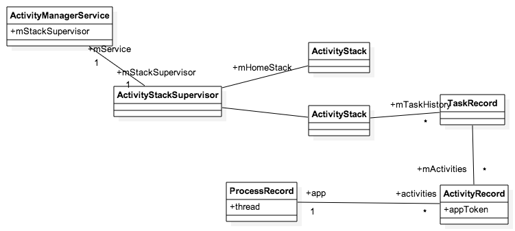
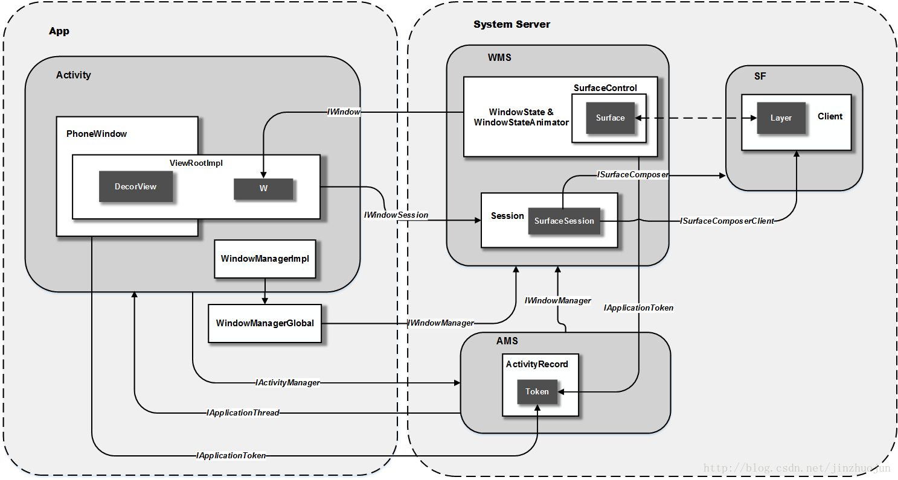
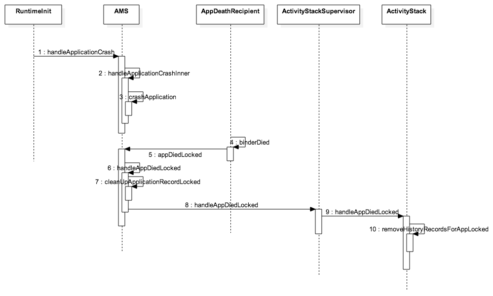
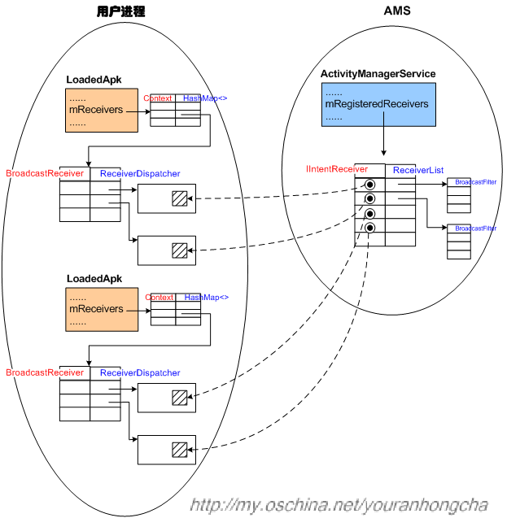
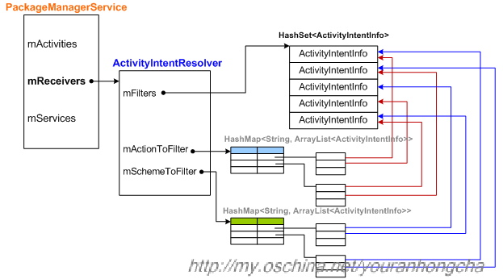

# ActitvityManagerService

ActivityServicesManagery是Android系统核心服务，管理了Activity，Service，BroadcastReceiver和ContentProvicer四个Android基本组件。AMS实现功能总多，所以类里面成员函数总多，涉及的其他类也比较复杂。学习分析AMS，从两个角度去看：
1. 实现总多的管理功能可以粗略分成几个部分（功能模块）来看（几个部分有很多逻辑的是相互交织在一起，所以才是一个AMS实现）
2. 通过一些重要的流程来学习分析AMS，如activity的启动过程

## AMS的职能
### Activity的管理
  Activity是什么？
  Activity如何存在？
  AMS为什么能管理Activity？
  Acitivity在AMS中组织方式？
  Activity的管理的三个问题:怎么样创建Activity（Activity启动），在Activity存活的时候可以对它做什么，怎么样销毁Activity（Activity自己正常退出和被动crash）

  

  
### Broadcast的管理
  Broadcast是什么？
  Broadcast有什么类型（如何分类）
  Broadcast的流程是怎么样的？

### ContentProvider的管理
  数据安全必然涉及权限，权限管理如何实现？

### Debug和Profile
基本命令

## 一些基本概念

Activity是Android组件中最基本的组件之一。在一个android应用中，一个Activity通常就是一个单独的屏幕，它上面可以显示一些控件也可以监听并处理用户的事件做出响应。Activity之间通过Intent进行通信。

一般c应用程序启动，都是在shell里面执行bin文件，然后系统就去启动这个应用程序。启动这个应用程序先开启一个新的进程，有些初始化的工作，然后开始执行main函数。Activity的启动需要一个intent，intent里面包括了几个信息，要启动包含几个信息，启动哪个Activity，然后以什么样的方式启动等。AMS处理intent，结合当前的状态来启动这个Activity。需要创建一个应用进程去运行这个Activity，初始化好Activity运行的上下文Context,开始运行Activity。c应用启动到main开始，控制权完全交给应用，由应用调用系统。Actvity则是已经定义好的类，写应用只能重写里面部分接口的实现，换句话说，从重写的接口的代码来说，是系统调用应用，不是应用调用系统。

几个相关概念：
* Activity: 描述一个交互场景，它是与用户交互的基本单元，同一时间只有一个Activity时可以与用户交互
* Application: 一个应用，运行在一个进程里，可以包含多个Activity，使用AndroidStudio或Eclipse新建一个工程就是一个应用。
* Process：进程，可以运行多个应用
* Task：描述完成一个特定的任务的基本单元，包含一个或多个Activity，Activity可以属于不同应用，运行在不同的进程
* ActivityStack：Task的一种组织方式，一个或多个Task组成的堆栈
* ActivityManager：应用端看到的ActivityManagerService的代理
* ActivityManagerService：一个服务，运行在system_server进程，管理所有的Activity，Task，ActivityStack

## Activity的组织结构

一个场景，打开一个OTA升级应用，这个时候开启了一个新的Task，所看到的OTA升级应用的Activity都是在这个Task里面，选择本地升级，跳到文件管理器，文件管理器的Activity，这个时候还是属于同一个Task。整个场景过程就是完成一次本地ota升级的任务，完成这个任务的Activity都属于同一个Task。Task时一种Activity的组织方式，由AMS管理，对应代码就是TaskRecord。Activity在应用端称为Activity，在AMS管理上只需要一个记录来表示Activity，即ActivityRecord。



图里面的对应关系：
* 一个ActivityManagerService对应一个ActivityStackSupervisor，AMS管理的不只是Activity还有Service，ContentProvider等，所以AMS里面由一些操作Activity相关接口作为入口，实际工作都是在ActivityStackSupervisor和ActivityStack里面实现的。
* 一个ActivityStackSupervisor里面本身设计是可以管理多个Stack，但是实际Android系统运行的时候一般只有两个Stack，一个是mHomeStack，里面放Luancher，其他应用都会放在另外一个Stack里面，所以图上只画了两个Stack。
* 一个Stack包含多个TaskRecord
* 一个TaskRecord包含多个ActivityRecord
* 一个ActivityRecord对应一个ProcessRecord，一个ProcessRecord对应多个ActivityRecord

补充一幅图描述了Activity和AMS，WMS的IPC的关系



### 启动一个activity

假设一个场景，从一个应用A的Activity启动另外一个应用B的activity（应用B本身没有启动的），整个过程如下流程图

实际调用过程比较复杂，而且整个调用过程实际不是单一线程简单同步往下走的过程，很多异步的调用，所以下图与真实的执行过程有差别，抽取了关键的调用过程简化画出来：


整个过程总体来说分两个部分：
* AMS接收到来自am的intent，到开启新的进程
* 启动新的应用进程，然后Activity开始在这个应用进程中运行

第一部分
1. 1~3都是在应用A进程里面的调用，从调用startActivityForResult(startActivity也是会调用到startActivityForResult)，开始在Instrument通过AMS代理调用startActvity
2. AMS在startActivityForResult里面调用ActivityStackSupervisor的StartActivityMayWait，这是个重要的入口。AMS里面有很多启动Activity的接口提供给不同对象调用，从应用进来的startActivity只是其中一个入口，还有其他入口，比如startActivityAsUser,startActivityAndWait,startActivityWithConfig等，都是会调用到ActivityStackSupervisor的StartActivityMayWait。在AMS的体系里面有很多这样类似的情况，很多调用的入口，但都会走到一些关键的调用点上。
3. 传递到StartActvityMayWait重要的是Intent，Intent可能没有指定启动哪个Actvity，所以在StartActvityMayWait首先会去通过PM解析这个Intent获取ActivityInfo（这个类纯粹的包含应用信息）然后检查来源是否有权限启动应用，调到startActivityLocked
4. AMS的startActivityLocked根据当前条件确认stack，并创建好新的ActivityRecord然后调用到AMS的startActivityUncheckedLocked
5. startActivityUncheckedLocked的逻辑很复杂，忽略细节，startActivityUncheckedLocked就是根据当前条件，包括Intent里面的Flag和本身应用的AndroidManifest的声明和当前task状态去确定当前新的ActivityRecord如何放进目前这堆Task里面（最简单的就是是否要新建Task，当然不止是确定这个问题）
6. 到ActivityStack里面的startActivityLocked里面，这个里面做了一件重要的事情，就是调用了WindowManager的addAppToken，这个时候在WMS那边正式有了这个Activity的记录
7. 到ActivityStack的resumeTopActivity开始pasue所有的Activity，通常情况只有一个Activity处于Resumed的状态，只需要pase这个应用A中发起这个Intent的Activity就好了。实际上通知了应用A去pause Activity后，AMS就会返回了，重新等待应用A通知完成pause后，继续工作
8. 在应用A中Activity完成pause后调用AMS的activityPaused,后续调用到resumeTopActivitiesLocked的时候，这个时候应该开始准备启动新的进程了
9. AMS里面有两个startProcessLocked，两个参数不一致，具体工作也不一样。里面会新建一个ProcessRecord作为新的进程的记录
10. 新建新的进程的过程这里没有画很清楚，实际在AMS里面通过Process类来启动新的进程，Process启动新的进程的方法就是通过Socket通知Zygoty去fork一个新的进程，然后告知AMS新fork出来的进程号是多少。这个时候AMS调用又可以返回了，开始等待进程启动。

第一部分走完，开始第二部分：
1. 等新fork出来的进程完成初始化后会调用到AMS的attachApplication，这个时候AMS在attachApplication里面对比pid值，就知道是之前要启动的那个进程，把这个进程和之前新建的ProcessRecord关联起来。在attachApplication里面完善了ProcessRecord的各种成员变量的赋值，同时调用到bindApplication
2. bindApplication是一个很关键的调用，之前只是fork出来一个进程，fork出来的进程可以跑任意的应用，怎么知道就是要跑应用B呢，就是通过bindApplication调用完成，把要跑的应用信息传给fork出来的进程。注意这里bindApplication只是一个“单项”的调用，通常AMS和应用间的IPC调用一般都是异步的，另一端执行完后会有通知AMS，bindApplication是不需要通知AMS
3. AMS调用ActivityStackSupervisor的attachApplicationLocked，最后IPC调用应用B的scheduleLauchActivity，应用端开始真正的启动新Activity
4. 应用端的ActivityTread，Instrument，Activity之间调用完成了写应用通常会重写的Activity的三个接口OnCreate,OnStart，OnResume


#### activity退出和crash

通常应用crash分两种，一种是native崩溃，一种java层崩溃
下图为java层崩溃的处理流程：

1. native层崩溃类似的，不过是从第2调用handleApplicationCrashInner开始处理，native层崩溃触发是从Android的debuggerd进程先捕抓到，然后通过socket通信到NativeCrashListener，然后通知的AMS的
2. 在crashApplication里面通知应用自杀，当应用完成自杀之后，通过binder的通知AMS继续下一步处理appDiedLocked
3. cleanUpApplicationRecordLocked里面把应用的ProcessRecord的内容清理干净，所有应用进程的service和contentProvider都会清理掉
4. 最后到ActivityStack里面清理ActivityRecord


## Broadcast

广播机制是Android基本机制之一。广播机制只要为了实现一处发生事情，多处得到通知的效果。这种通知工作常常要牵涉跨进程通讯，由ActivityManagerService来管理

#### 两种BroadcastReciver

应用能使用的广播有两种，一种是静态注册，也就是在应用的AndroidManifest.xml上注册。另外一种是动态的，在代码执行过程中注册和注销。

注册BroadcastReceiver包含两个重要的类一个是BroadcastReceiver和BroadcastFilter。静态注册往往只需要在AndroidManifest.xml里面声明BroadcastReceiver，并接收什么广播。在动态注册两个都要想要的实例，调用registerReceiver注册。BroadcastReceiver描述的是收到广播后做什么，BroadcastFilter描述的时候什么广播符合。BroadcastReceiver和BroadcastFilter没有必然的数量对应关系。一个BroadcastReceiver可以对应一个或者多个BroadcastFilter，一个BroadcastFilter也可以提供给多个BroadcastReceiver使用。

##### 动态注册BroadcastReceiver
通常动态注册BroadcastReceiver，调用Context的registerReceiver接口，最后调用到ContextImpl的registerReceiverInternal,下面一部分代码引用：

```

private Intent registerReceiverInternal(BroadcastReceiver receiver,
                                        IntentFilter filter, String broadcastPermission,
                                        Handler scheduler, Context context) 
{
    IIntentReceiver rd = null;    
    if (receiver != null) 
    {        
        if (mPackageInfo != null && context != null) 
        {            
            if (scheduler == null) 
            {
                scheduler = mMainThread.getHandler();
            }
            rd = mPackageInfo.getReceiverDispatcher(receiver, context, scheduler,
                               mMainThread.getInstrumentation(), true);
        }
        . . . . . .
    }    
    try 
    {        
        return ActivityManagerNative.getDefault().registerReceiver(
                mMainThread.getApplicationThread(), mBasePackageName,
                rd, filter, broadcastPermission);
    } 
    catch (RemoteException e) 
    {        
        return null;
    }
}
```

重点关注IIntentReceiver，原型是定义在LoadApk的嵌套类，这个提供给AMS接收到广播回调用的通路

在AMS这端通过mRegisteredReceivers来保存动态注册的BroadcastReceiver
```
 final HashMap<IBinder, ReceiverList> mRegisteredReceivers =
            new HashMap<IBinder, ReceiverList>();
```
ReceiverList的定义是
```
class ReceiverList extends ArrayList<BroadcastFilter>
        implements IBinder.DeathRecipient
```
一个ReceiverList对应是应用端一个BroadcastReceiver，里面可能有多个可以触发的BroadcastFilter

下图是网上看到的一张描述应用端和AMS关于BroadcastReceiver对应关系的图



##### 静态注册BroadcastReceiver
静态注册的BroadcastReceiver是通过AndroidManifest.xml注册的，所以相关的信息会保存在PMS里面，而不是在AMS里面，当有需要的时候AMS像PMS查询相关信息。
PMS通过ActivityIntentResolver保存静态注册BroadcastReceiver的信息
下图是描述ActivityIntentResolver的结构图:


### 广播的流程
广播流程图如下


1. 无论是发送什么广播，sticky还是ordered，都是通过AMS的broadcastIntent接口作为入口发送广播
2. 实际干活的一般的都带Locked后缀，因为Binder调用过来都不是服务本身的主线程，要不加锁保障同步，要不就是利用Handler发一个消息到主线程去处理，broadcastIntent这里加了锁调用broadcastIntent。在调用broadcastIntentLocked之前其实还调用了verifyBroadcastLocked，图上没有画出来，verifyBroadcastLocked的作用主要是检查是否在启动完成之前发广播，启动完成之前没有加FLAG_RECEIVER_REGISTERED_ONLY_BEFORE_BOOT标志的广播是不允许发的
3. broadcastIntentLocked所做第一件事就是给广播加上FLAG_EXCLUDE_STOPPED_PACKAGES，含义是默认不会出发没有启动的应用的静态注册的BroadcastReceiver，除非广播Intent增加了FLAG_INCLUDE_STOPPED_PACKAGES标志
4.  broadcastIntentLocked接下来需要处理一些系统广播，比如Package类广播。这些主要从PMS发出来。比如，当PKMS处理APK的添加、删除或改动时，一般会发出类似下面的广播：ACTION_PACKAGE_ADDED，ACTION_PACKAGE_REMOVED，ACTION_PACKAGE_CHANGED，ACTION_EXTERNAL_APPLICATIONS_UNAVAILABLE，ACTION_UID_REMOVED
5. broadcastIntentLocked再下一步对如果是sticky作一些特殊处理
6. 接下来就是调用collectReceiverComponents去PMS查询所有声明响应这个广播的静态注册receiver和到mReceiverResolver收集相应的动态注册recevier
7. 如果不是ordered类型广播，新建一个BroadcastRecord，把动态注册的广播放进去，然后插入到平行广播队列里面，触发BroadcastQueue处理待广播的BroadcastRecord。注意BroadcastQueue有两个队列，一个平行广播，一个顺序广播。
8. 再把静态和动态recever合并放入新建BroadcastRecord里面然后，插入到顺序广播队列里面，触发BroadcastQueue处理待广播的BroadcastRecord。这里当时看了很久没想明白合并静态和动态recever那么不和之前的插入平行广播队列的BroadcastRecord的动态recevier重复了，动态recevier会触发两次？后面发现漏了一句话，一开始使用动态recevier后会把动态recevier的list置为null，合并动态和静态的目的就是当指定发ordered类型广播时候，是不会创建一个BroadcastRecord到平行广播队列里面。发一个普通的广播，可能对应有两个BroadcastRecord
9. BroadcastQueue里面有自己的handler，AMS只是插入BroadcastRecord，然后调用scheduleBroadcastsLocked，再handler里面调用processNextBroadcast真正处理BroadcastRecord
10. processNextBroadcast最先处理平行广播队列，因为简单，只需要通知相关进程就可以了。处理顺序队列比较麻烦，因为是顺序，必须一个接一个的通知，通知下一个之前上一个必须执行完，所以还会有个处理的timeout，超过timeout，就会向AMS报ANR。
11. 处理平行广播队列，通过deliverToRegisteredReceiverLocked，到performReceiveLocked，最后调到应用进程的ActivityThread的scheduleRegisteredReceiver
12. 注意触发动态recevier有两条通路，图上只画了一条，就是调用scheduleRegisteredReceiver，再调到InnerReceiver的performReceive，另外一条通路就是在performReceiveLocked直接调到InnerReceiver的performReceive。在无论哪条路，最后出发到BroadcastRecevier的onReceive
13. 注意为什么BroadcastRecevier处理时间过长会导致ANR？ReceiverDispatcher会向AtivityTread去post一个Args（ReceiverDispatcher的嵌套类，实现Runable接口），在Args的run函数里面调用BroadcastRecevier的onReceive，也就是onReceive是在UI线程里面执行的
14. 静态recevier的广播会更加麻烦一些，在BroadcastQueue里面先要检查应用是否启动,没有启动要先启动，然后把当前的BroadcastRecord设为mPendingBroadcast,然后返回了。等待应用进程起来的时候，在AMS执行attachApplication的时候，在去通知应用进程响应广播


## ContentProvider权限管理

ContentProvider是提供跨进程数据查询，增加，修改，所以必然有一套权限管理机制，这套权限管理的机制实现都在AMS里面
AMS里面关于ContentProvider的权限管理回答下面几个场景的权限问题：
1. A应用有一个ContentProvider，只希望开放读权限给其他应用，不希望其他应用能有写权限
2. A应用有一个ContentProvider，里面有很多数据，希望有一部分数据完全不开放，一部分开放读权限或读写权限
3. A应用有一个ContentProvider，B应用有权限读，希望委托C应用去解析应用，C应用本身无权限

所有权限的声明和配置在AndroidManifest.xml里面，所以解析都是由PMS解析，但是真正实现权限的管理和判定是在AMS里面

如果ContentProvider需要把权限开放出来，首先在AndroidManifest.xml里面声明exported=true
```
<provider android:name=".AProvider" 
    android:authorities="AProvider" 
    android:exported="true" /> 
```

下一步可以定义权限
```
<permission android:name="permission.READ_A_CONTENTPROVIDER" 
    android:label="Allow read A content provider" 
    android:protectionLevel="normal" />  

<provider android:name=".AProvider" 
    android:authorities="AProvider" 
    android:readPermission="permission.READ_A_CONTENTPROVIDER"
    android:exported="true" > 
</provider> 
```
如果其他应用有这样的声明就可以获取到读权限
```
<uses-permission android:name="permission.READ_A_CONTENTPROVIDER" />
```
如果是声明部分数据权限的话
```
<provider android:name=".AProvider" 
    android:authorities="AProvider" 
    android:readPermission="permission.READ_A_CONTENTPROVIDER" 
    android:exported="true" > 
    <path-permission android:pathPrefix="/A1" android:readPermission="READ_A1_CONTENTPROVIDER" />
</provider> 
```
其他应用需要读取A1数据类似声明权限即可
应用要定义权限传递定义
```
<provider android:name=".AProvider" 
     android:authorities="AProvider" 
     android:readPermission="READ_A_CONTENTPROVIDER" 
     android:exported="true" >  
     <grant-uri-permission android:pathPrefix="/A1" />
</provider> 
```

AMS实现权限管理就是通过mGrantedUriPermissions来保存那些应用有哪些uri的什么权限
```
    private final SparseArray<ArrayMap<Uri, UriPermission>>
            mGrantedUriPermissions = new SparseArray<ArrayMap<Uri, UriPermission>>();
```
SparseArray不是一个List容器，他是一个Map，所以一般要增加元素的时候是这样的
```
//targetUid是应用的uid,targetUris则是这个uid应用的拥有的所有的uri的权限集合
//targetUris类型为ArrayMap<Uri, UriPermission>
mGrantedUriPermissions.put(targetUid, targetUris);
```

mGrantedUriPermissions管理的有些权限可以定义为永久的，会写到/data/system/urigrants.xml里面，在AMS里面读取和保存的函数是：
```
private void writeGrantedUriPermissions()
private void readGrantedUriPermissionsLocked()
```

权限传递的方法可以通过Intent来传递，在Intent里面加上FLAG_GRANT_READ_URI_PERMISSION或FLAG_GRANT_WRITE_URI_PERMISSION，在启动应用的流程中的ActivityStackSupervisor的startActivityUncheckedLocked会调用AMS的grantUriPermissionFromIntentLocked进行授权


还可以调用Context的grantUriPermission接口？


## Debug
dumpsys activity -h能看到更多细致dump命令包括activity，broadcast等等

## 心得
AMS里面的代码流程错综复杂，理解下来感觉最重要的一点是：
**AMS的调用都是通过Binder调用的，所以入口函数所在线程肯定不是AMS的handler所在的线程，保持多线程能够正确执行，还是靠synchronized同步，synchronized里面调用的函数一般都会带Locked后缀，另外就是发消息到handler去排队处理**