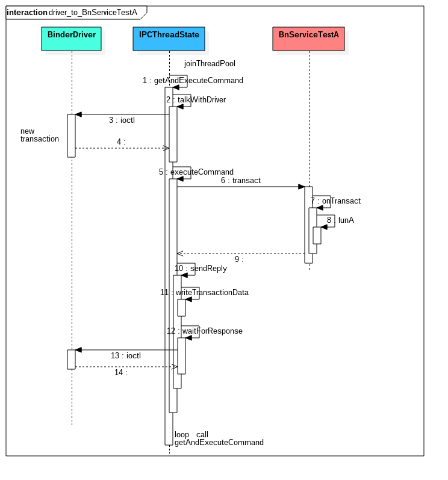

# Binder笔记_libbinder

## libbinder

libbinder对上，提供业务代码基本的binder通信接口，对下与kernel的binder驱动交互，完成binder通信实现。

libbinder代码分为三类
1. 第一类是核心提供连接业务与binder驱动的功能
2. 第二类是提供一些Android系统服务接口、共享内存封装接口，如IBatteryStats，IMemory
3. 第三类是一些工具辅助类，如Status，Value

核心代码如下：
```
frameworks/native/include/binder/Binder.h
frameworks/native/include/binder/BpBinder.h
frameworks/native/include/binder/IBinder.h
frameworks/native/include/binder/IInterface.h
frameworks/native/include/binder/IPCThreadState.h
frameworks/native/include/binder/Parcelable.h
frameworks/native/include/binder/Parcel.h
frameworks/native/include/binder/ProcessState.h

frameworks/native/libs/binder/Binder.cpp
frameworks/native/libs/binder/BpBinder.cpp
frameworks/native/libs/binder/IInterface.cpp
frameworks/native/libs/binder/IPCThreadState.cpp
frameworks/native/libs/binder/Parcel.cpp
frameworks/native/libs/binder/ProcessState.cpp
```


## Binder主要类及关系

### IBinder与IInterface及其子类


说明：
1. IBinder定义其中一个接口queryLocalInterface，并不是给BnBinder，BpBinder使用而是给IIterface

### 其他类

1. Parcel主要提供序列化与反序列化接口；
2. ProcessState与IPCThreadState理解为一种上下文类（Context Class）。ProcessState是与进程对应，IPCThreadState是与线程对应。


## Binder通信流程

以《Binder笔记_Binder服务例子》中的ServiceTestA为例

从Bp端发起：

从Bn端接收处理：


1. 从流程看出，Binder驱动的交互都是依靠IPCThreadState
2. 如果带有TF_ONE_WAY标志， Bp端在WaitForResponse里面得到Driver的发送成功信息（BR_TRANSACTION_COMPLETE）则返回，否则需要等待Reply的Parcel才会返回。对于是Bn端，如果带TF_ONE_WAY，就不会执行sendReply

