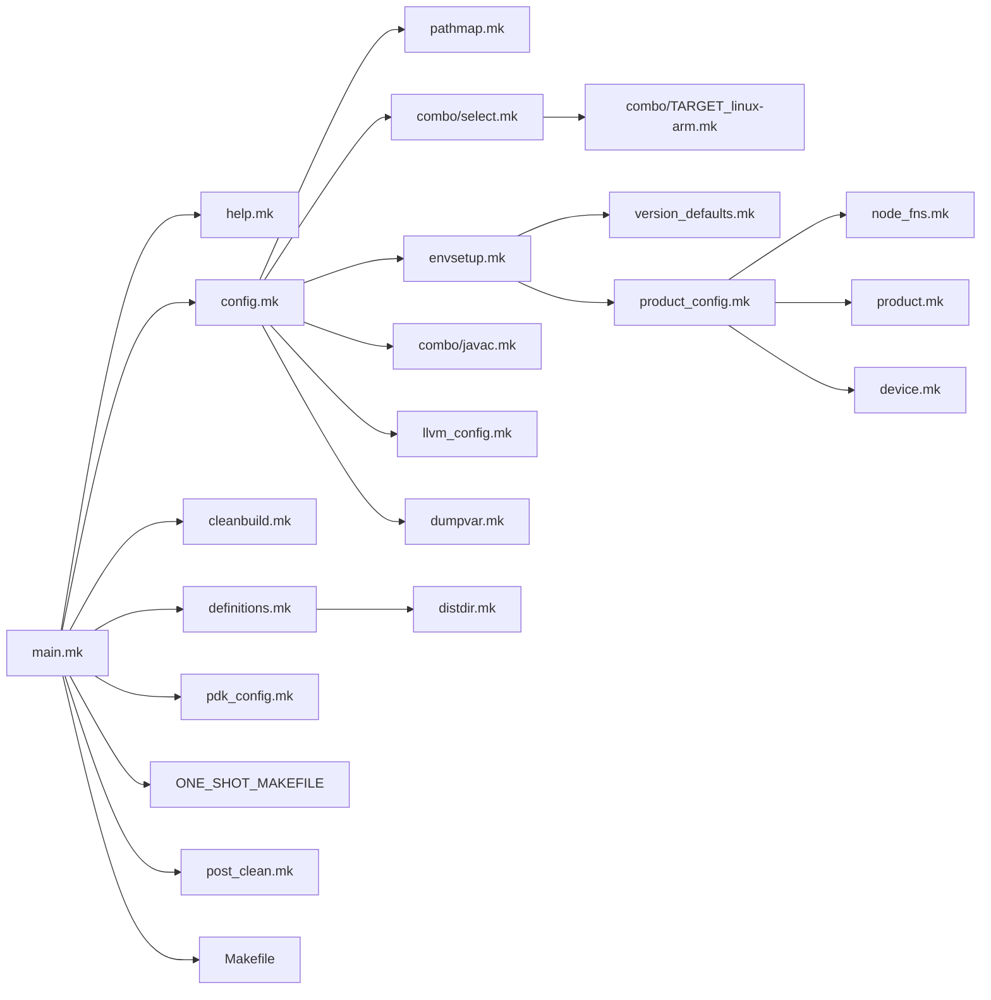

Makefile 包含关系

```mermaid
graph LR;
main.mk-->help.mk;
main.mk-->config.mk;
main.mk-->cleanbuild.mk;
main.mk-->definitions.mk;
main.mk-->pdk_config.mk;
main.mk-->ONE_SHOT_MAKEFILE;
main.mk-->post_clean.mk;
main.mk-->Makefile;
config.mk-->pathmap.mk;
config.mk-->envsetup.mk
config.mk-->combo/select.mk;
config.mk-->combo/javac.mk;
config.mk-->llvm_config.mk;
config.mk-->dumpvar.mk;
combo/select.mk-->combo/TARGET_linux-arm.mk;
definitions.mk-->distdir.mk;
envsetup.mk-->version_defaults.mk;
envsetup.mk-->product_config.mk
product_config.mk-->node_fns.mk
product_config.mk-->product.mk
product_config.mk-->device.mk
```
这里主要的包含关系，不代表编译不同的对象make都会按照这个包含关系包含

模块编译隔离 MODULE.xxx.SRC
方案编译隔离 PRODUCT.xxx.PRODCUT_NAME
一个native程序编译make执行过程做例子
native，库，静态库，java.jar，应用编译粗略过程
