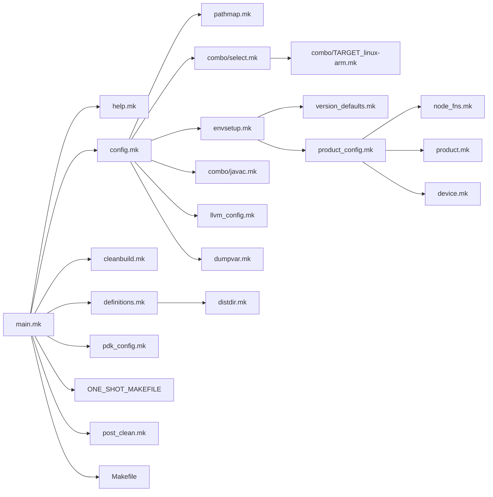

Makefile 包含关系

这里主要的包含关系，不代表编译不同的对象make都会按照这个包含关系包含

模块编译隔离实现 ALL_MODULES.xxx.SRC
方案编译隔离实现 PRODUCT.xxx.PRODCUT_NAME

模块编译各个主要目标依赖关系，LOCAL_INTERMEDIATE_TARGETS

主要mk文件内容介绍
base_rules.mk：
1. 检查LOCAL_MODULE是否定义以及唯一性
2. 检查是目标平台（TARGET还是HOST），TAG（optional，eng，user），对相应变量赋值处理
3. LOCAL_UNINSTALLABLE_MODULE，LOCAL_PRIVILEGED_MODULE处理：影响LOCAL_MODULE_PATH，最终生成目标路径
4. 转化aidl为java
5. 转化logtags为java
6. 转化proto为java
7. 如果需要编译java把aidl等格式转化的java加入到待编译的java文件列表中
8. 定义clean-$(LOCAL_MODULE)，清理模块编译中间文件，主要清理在out/target/product/common下的内容
9. 在编译目标作用域内，转化LOCAL_XXX变量为PRIVATE_XXX变量
10. 把模块编译相关的LOCAL_XXX注册到ALL_MODULES.XXX，用于全局模块编译管理
11. 定义LOCAL_MODULE依赖LOCAL_BUILD_MODULE，LOCAL_INTALLED_MODULE。LOCAL_BUILD_MODULE是模块编译过程的最终输出，LOCAL_INSTALLED_MODULE是一些拷贝和对app预先优化的工作
12. 

main.mk
1. 定义SHELL，POWD，TOP，BUILD_SYSTEM，FORCE等编译过程常用的变量
2. 包含config.mk，config.mk初始化大部分编译时候常用变量，包括编译工具，编译flag，编译相关路径等
3. product_config.mk包含node_fns.mk定义处理product的一些函数，product.mk定义产品相关的变量和函数，device.mk定义了一些产品相关的函数。product_config.mk根据lunch命令设下的环境变量加载产品对应的mk文件。product_config完成所有产品相关变量处理。

一个native程序编译make执行过程做例子
一个apk编译流程作为例子

方案配置模板：

Android.mk模板

调试技巧
$(warnning xxxx)

