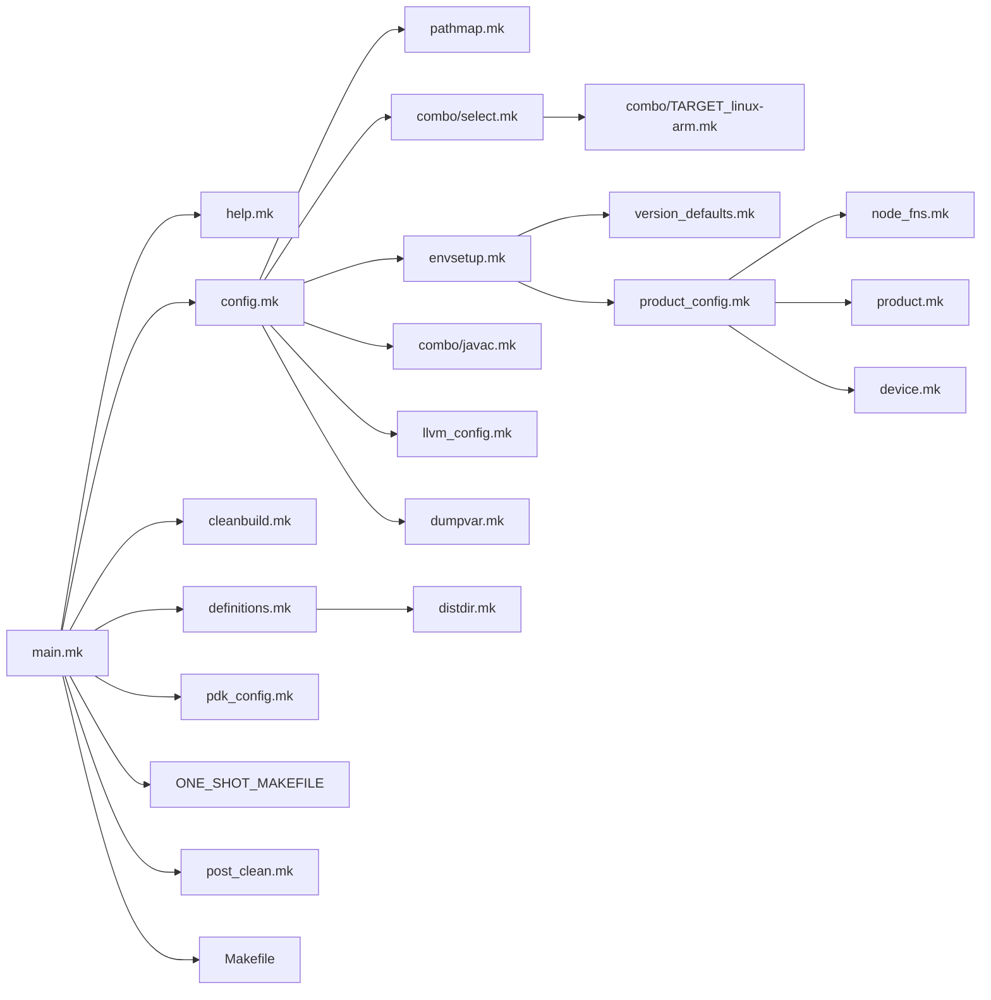
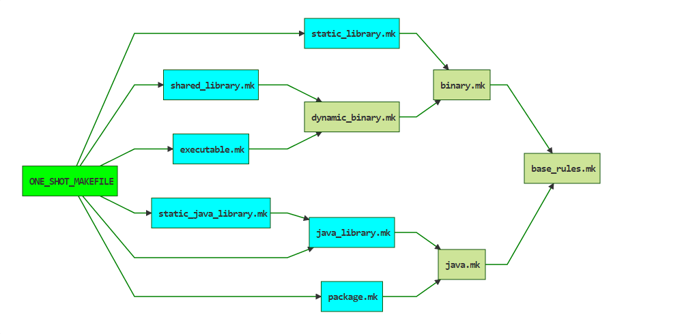

#Android 编译系统学习笔记（Android4.4)

####Makefile 包含关系


这里主要的包含关系，不代表编译不同的对象make都会按照这个包含关系包含


####主要mk文件内容介绍
##### main.mk，编译任意目标的Makefile入口点
1. 初始化SHELL，POWD，TOP，BUILD_SYSTEM，FORCE等编译过程常用的变量
2. 包含config.mk，config.mk初始化大部分编译时候常用变量，包括编译工具，编译flag，编译相关路径等
3. product_config.mk包含node_fns.mk定义处理product的一些函数，product.mk定义产品相关的变量和函数，device.mk定义了一些产品相关的函数。product_config.mk根据lunch命令设下的环境变量加载产品对应的mk文件。product_config完成所有产品相关变量处理。
4. 检查java版本，检查编译目标相关变量是否合法
5. 根据编译目标类型eng，user，userdebug设置system属性和标记要编译的模块类型
6. 如果类似m，mm命令编译的会定义有ONE_SHOT_MAKEFILE，则include ONE_SHOT_MAKEFILE；如果是编译sdk，则按照查找规则递归包含Android.mk，得到所有的模块定义
7. 按照编译目标，处理当前所有已知的模块，筛选出要需要编译的模块
8. 包含Makefile。并根据编译目标，定义Makefile里面boot,system镜像等目标的依赖关系

##### MakeFile，编译sdk主要主要生成目标的定义
1. 处理PRODUCT_COPY_FILE，进行拷贝
2. 处理build.prop，把一些编译变量放入到android属性文件
3. 定义ramdisk，boot.img，system.img，vendor.img，target_file，ota的依赖关系和生成规则

##### base_rules.mk，编译任意模块都需要包含的通用规则
1. 检查LOCAL_MODULE是否定义以及唯一性
2. 检查是目标平台（TARGET还是HOST），TAG（optional，eng，user），对相应变量赋值处理
3. LOCAL_UNINSTALLABLE_MODULE，LOCAL_PRIVILEGED_MODULE处理：影响LOCAL_MODULE_PATH，最终生成目标路径
4. 定义aidl编译为java规则
5. 定义logtags编译为java规则
6. 定义proto编译java规则
7. 如果需要编译java把aidl等格式转化的java加入到待编译的java文件列表中
8. 定义clean-$(LOCAL_MODULE)，清理模块编译中间文件，主要清理在out/target/product/common下的内容
9. 在编译目标作用域内，转化LOCAL_XXX变量为PRIVATE_XXX变量
10. 把模块编译相关的LOCAL_XXX注册到ALL_MODULES.XXX，用于全局模块编译管理
11. 定义LOCAL_MODULE依赖LOCAL_BUILD_MODULE，LOCAL_INTALLED_MODULE。LOCAL_BUILD_MODULE是模块编译过程的最终输出，LOCAL_INSTALLED_MODULE是一些拷贝和对app预先优化的工作
12. 

##### binary.mk，编译native模块都会包含的通用规则
1. 初始化NDK相关变量
2. 计算静态库依赖关系
3. 包含base_rules.mk
4. 编译器以及编译flag按照编译目标和环境进行配置，并定义相关的PRIVATE变量
5. 转化renderscript为c
6. 定义proto编译为c，并编译为目标文件规则
7. 定义编译yacc编译为c，并编译为目标文件规则
8. 定义编译lex编译为c，并编译为目标文件规则
9. 定义编译c，c++为目标文件规则
10. 定义编译汇编文件为目标文件规则


##### config.mk
1. 定义native编译通用的头文件包含路径
2. 定义模块Android.mk包含的mk文件变量定义，如CLEAR_VARS，BUILD_PACKAGE
3. 包含envsetup.mk，envsetup.mk
4. 按照编译PRODUCT目标，查找并包含相应的BoardConfig
5. 定义各种编译过程中需要用到的工具

##### envsetup.mk 
1. 包含了product_config.mk
2. 定义各种OUT目录相关路径的变量

##### product_config.mk
1. 包含node_fns.mk，product.mk,device.mk，三个mk里面都是Product相关的变量和函数的定义
2. 根据lunch命令设置的环境变量，查找并包含目标Product的mk
3. 完成相应的Product继承关系，对Product相关的变量整理s

#### 其他主要makefile
build_id.mk : 定义BUILD_ID，代表Android的分支和realease版本
cleanbuild.mk : 定义清理相关函数以及清理相关编译目标，如installclean
clean_vars.mk : 用于模块Android.mk开通清理LOCAL开通变量
definitions.mk ： 定义了各个种类通用函数，比如变量的过滤处理，transform开头编译规则函数等
device.mk : 定义device相关（product相关）的函数
dex_preopt.mk : 定义dex优化相关变量，如果工具路径等，dex优化编译规则
dynamic_binary.mk : 定义编译动态二进制（库和可执行）的规则
exectuble.mk : 定义编译可执行native程序规则，会包含dynamic_binary.mk
help.mk : 定义help伪目标
java.mk ：会包含base_rules.mk，base_rules.mk已经定义好编译java为class的规则，java.mk主要变为jar后加入emma，代码混淆等规则
java_library.mk ： 编译java库规则
product.mk ： 定义一个Product的相关变量以及函数


### 一些问题
##### 每个模块Android.mk里面LOCAL开头变量定义是什么区分的?编译sdk的时候是怎么知道有重复相同模块名字的定义？
1. 所有模块的定义都是一个模式先include $(CLEAR_VARS)，把LOCAL开通的变量全部清理，然后在根据编译目标类型去include $(BUILD_EXECUTABLE)或者$(BUILD_PACKAGE)等，这些mk最后都会包含base_rules.mk。在base_rules.mk里面根据模块名字，编译目标类型，是HOST还是TARGET来生成一个id，检查是否和已有的id重复，如果重复，就会有"xxx alread defined by xxx“错误打印。换一种情况，如果使用mm命令编译的时候，由于makefile没有去查找包含sdk中的Android.mk，所以也不会也重复定义的错误。
2. 在base_rules.mk里面也会把一些必要的LOCAL开头的变量转化为ALL_MODULES.$(LOCAL_MODULE).xx变量，然后继续包含其他模块的时候$(CLEAR_VARS)把LOCAL开头的变量清除了，这样就实现了模块LOCAL开头变量区分。
3. LOCAL开头的变量只是在Make加载的时候有意义，编译时不同模块有都可能有代码源代码路径的变量，他们的区分就通过属于具体模块编译目标的作用空间的Private开头的变量做区分

##### lunch命令如何把选择的产品目标告诉后续的make，编译sdk主要的流程是怎么样的
1. lunch命令根据选择的产品方案，把方案名保存在TARGET_PRODUCT环境变量中，把编译版本eng，user还是userdebug保存在TARGET_BUILD_VARIANT里面
2. sdk编译主要流程：初始化必须编译变量，然后加载方案配置，根据配置继续初始化编译变量（比如不同平台选择不同编译器等），然后开始查找加载sdk中各个Android.mk，筛选要编译的模块，明确system.img，boot.img，recovery.img等编译目标的依赖关系，然后开始编译。

##### m，mm，mmm命令是如何编译一个模块的
先找到要编译的Android.mk，把目标Android.mk文件路径保存在环境变量ONE_SHOT_MAKEFILE，然后执行类似的执行
```
make -C $T -f build/core/main.mk $MODULES $ARGS
```
其中$T是sdk的根目录，用-C参数使得构建前先先换路径，切换到sdk根目录后指定makefile为 build/core/main.mk，一般情况$MODULES的值是ALL_MODULE，只编译makefile包含ONE_SHOT_MAKEFILE解析到的模块，不是整个Android

##### 模块的编译编译makefile包含关系：



***


方案配置模板：
Android.mk模板:

常见变量含义

make构建过程分析手段
1. 使用warnning语句来打印
2. make --debug=b  或者 mm --debug=b
3. 把要命令中$(hide)去掉

MakeFile语法备忘:
1. 


