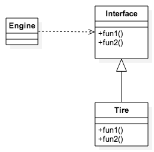

### 高焕堂《》培训的理解

这次培训的内容包括了高焕堂定义的EIT架构、Android的框架和他作为资深架构师关于软件架构的观念。三天的培训的内容总体上不是很多，很多时间是在举各种例子引导我们思考。关于很多软件架构的观念，在他的《思考软件,创新设计:A段架构师的思考技术》里面都有，课程很多内容也从他的书中里面抽出来讲的

#### EIT造型
EIT造型里面的E代表Engine，I代表接口，T代表Tire。比喻软件框架就像是一辆汽车，在不同的场景，应对各种环境变化，汽车的Engine是不会变的，变的只是Tire，不同的Tire应对不同的路况。软件框架就是要做这种事情，完成Engine，提供接口，在不同的业务逻辑匹配不同的Tire。
EIT的类图如下：

在Android里面，写应用的时候写的Activity。写应用通常都是写一个子类继承Activity。然后在应用运行的过程中，实际上是Android框架创建一个应用完成的Activity的子类的对象，然后调用它实现的onCreate等等的接口，Engine就是指Android的Instrument类，由它来完成对Activity子类的调用。
我理解这种模式就是设计模式中的策略模式，Engine实际上已经定义好了所有的调用流程，只需要Tire完成一些实际业务逻辑即可。

强势接口与弱势接口，这个也是高焕堂提出来的。我不知道我理解对不对，但我的理解就是强势接口就是调用流程的制定者，弱势接口就是被调用的一方。
EIT就是一种强势接口，因为Engine代表调用流程的制定。假设A和B模块中的交互使用了EIT，A模块掌握了E，就是强势的一方。A和B各自升级，A可以修改流程不调用B提供的T的某些接口，但是对于B来说，B还是被动要完成接口的实现。
其实我觉得两个模块交互方式就只用两种，一种就是像Android里面的MediaPlayer一样，直接提供接口供应用调用，一种就是EIT，实现接口的一方让另一方去调用。
我理解的主要区别在于开发的时间上，Android框架必须先完成，应用的开发一定是之后再完成的，所以Android框架中有些事直接提供接口如MediaPlayer，有些像Activity提供父类，应用实现子类。
使用哪一种方式是什么决定的，是不是都要是EIT让自己这一方强势？我觉得这个完全是由具体的功能的逻辑决定的。如MediaPlayer必须就是提供接口给应用，因为，播放视频，还是停止，还是快进，这个由应用的业务逻辑决定，应用定义了一个播放按钮，只有应用自己才知道什么时候这个按钮被按下了，应该去播放，决定流程的一方是应用，所以MediaPlayer只能是这种提供接口的方式。Android的Activity是否只能是框架提供父类，应用实现子类的方式，我理解也必须是这样，很多流程的发起是由系统或其他应用发起的，不是本身发起，那么即使不是Activity作为父类，也需要一个其他的东西作为父类给应用实现接口去完成一些流程中间业务逻辑。

#### 架构的一些思考
在培训中，我接触到关于架构的一些思考角度如下：
##### 领域知识和买主知识
领域知识是除去业务相关内容，基本软件框架实现的功能
买主知识就是业务逻辑
在定框架的时候，分清楚哪些应该框架实现，哪些事由这个框架的使用者来做的。在Android里面典型的就是Binder，Binder它纯粹的考虑了通信的实现方式，提供通用的接口给各种Android的Service使用，这是一个很好框架设计的范例。
Binder本身也是典型的EIT模式，Service去继承Binder定义好的父类，只要专心实现好Service本身的接口就好了，不需要过多关心调用的过程。

##### 架构与分工
框架的设计很重要一个点就是，如何分工。高焕堂举了一个很好的例子：杭州的阿里搭好支付宝的服务器框架，北京的阿里要在某个客户端上加入一个新的功能，新的功能需要跑在服务器上，良好的框架，可以让北京的阿里自己完成服务器端的业务逻辑，不需要让杭州的阿里去完成。类似于EIT里面的T是由北京的阿里去完成，不是杭州的阿里。

##### 架构和碎片化
google前面临着Android严重碎片化问题，各个手机厂商定制修改自己的Android系统。我觉得google设计Android框架加入了方便自身GMS的改动，加强Android和google的服务的联系。阿里做盒子，软件和硬件都制定了很多的限制，来控制盒子的碎片化的问题。对于我们芯片原厂，其实面对着各种不同产品形态的智能产品的需求，不同业务对相同产品的需求，我们自身面临的碎片话问题其实也不容乐观。良好的框架的设计可以减少应对不同需求的很多重复工作，提供效率和产出。对于我们来说，在我们定制提供的一系列功能上多考虑基础功能流程和策略的分离。

##### 集装箱的观念
最近有个东西叫Docker很流行，虽然不是很了解，大致就是符合要求的程序装在Container集装箱里面，然后可以很方便不同的服务器中移动，执行。集装箱的思想就是定义通用的东西把变的东西包起来。

##### 人，汽车，红绿灯
我很喜欢这个例子，人和汽车各自有各自的目的地，有各自的速度，怎么能保证交通系统能正常运行呢？不是去改变人和汽车的行为，不是要让人和汽车知道对方的存在，而是要制定好规则，让人和汽车按照规则走，整个系统就会变得有序。这个就是代表着不同的模块要降低耦合，框架保障整个系统有序的运作。

#### 其他
在培训中最让我触动的不是，软件知识，而是高焕堂这个人。他已经60多岁了，对于Android才出来几年的Android，能够了解这么多，能够到处给别人做培训，真的很了不起。谁说做技术是青春饭？！