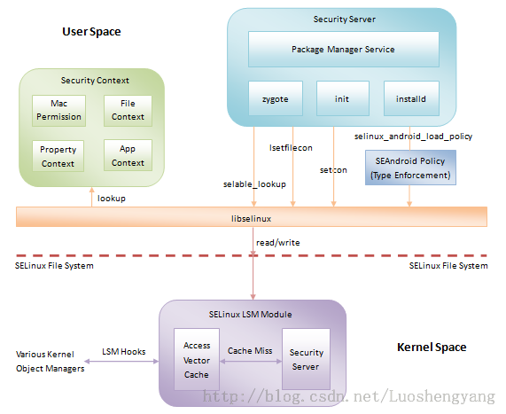

#SELinux(Android)

####介绍
SELinux 全称 Security Enhanced Linux (安全强化 Linux)，是 MAC (Mandatory Access Control，强制访问控制系统)的一个实现，++**目的在于明确的指明某个进程可以访问哪些资源(文件、网络端口等)**++。
强制访问控制系统的用途在于增强系统抵御 0-Day 攻击(利用尚未公开的漏洞实现的攻击行为)的能力。
**++Android 在SELinux上作了一些定制。++**有人把它叫做SEAndroid。在4.3上开始引入selinux，使用Permissive模式，4.4上使用部分Enforcing模式，5.0开始全面Enforcing模式


#### selinux框架介绍
selinux的基本的原理是通过编译时决定的安全策略，在各个系统调用中加入hook做权限判断。
Android上面selinux的框架如下图所示：

~（图片来源互联网，罗升阳的博客）~

图中分三个角色：
- 绿色部分为安全策略，编译时决定
- 蓝色部分负责加载安全策略，使能安全策略，在已有安全策略下，操作进程和资源的context，libselinux为蓝色部分提供api
- 紫色部分为安全策略的执行，由它来判定是否违反安全策略

#####Android selinux相关代码配置位置
- external/sepolicy：提供了Android平台中的安全策略源文件。同时，该目录下的tools还提供了诸如m4,checkpolicy等编译安全策略文件的工具
- external/libselinux：提供selinux管理的接口
- external/libsepol：提供了供安全策略文件编译时使用的一个工具checkcon。

##### Android上的安全策略定制
sepolicy是selinux安全策略定义，位于external/sepolicy下面。
Android的各个方案可以增加自己的策略作为external/sepolicy的补充，但不能与external/sepolicy冲突，通常通过BoardConfig.mk指定补充的规则文件
```makefile
BOARD_SEPOLICY_DIRS += \
        <root>/device/manufacturer/device-name/sepolicy

BOARD_SEPOLICY_UNION += \
        genfs_contexts \
        file_contexts \
        sepolicy.te
```

####SELinux工作模式
#####获取当前 SELinux 工作模式
`getenforce`
可能返回结果有三种：Enforcing、Permissive 和 Disabled。Disabled 代表 SELinux 被禁用，Permissive 代表仅记录安全警告但不阻止可疑行为，Enforcing 代表记录警告且阻止可疑行为。

#####改变 SELinux 工作模式
`setenforce [ Enforcing | Permissive | 1 | 0 ]`
该命令可以立刻改变 SELinux 工作模式，在 Enforcing 和 Permissive 之间切换，结果保持至关机。一个典型的用途是看看到底是不是 SELinux 导致某个服务或者程序无法运行。若是在 setenforce 0 之后服务或者程序依然无法运行，那么就可以肯定不是 SELinux 导致的。

###SEAndroid TE规则
####基本概念
##### context（label）
在selinux里面context和label是同一个含义，中文上面理解标签（label）更加容易理解。
selinux的基本控制权限的方法是，给不同的进程、文件打上标签（label），通过定义不同label之前的关系，来实现权限控制。

打开selinux的情况下执行：
`ls -Z /init.rc`
看到：
`-rwxr-x---  root    root       u:object_r:rootfs:s0  init.rc`
这里一共有4项内容： u , object_r, rootfs, s0
u表示user， object_r表示role，  rootfs表示type，  s0是Security Level
通过不同的user， role，tcontext，Security Level来控制权限


另外执行:
`ps -Z init`
看到：
`u:r:init:s0         root   1    0   /init`
和文件类似，也是4项内容

**Android上面只用到了type这个label来控制权限，其他三个label在selinux里面也可以完成其他机制的权限控制。所以下面的内容只涉及基于type权限控制的规则和关系**


##### type，domain，scontext，tcontext
MAC的机制分两中角色，主体和客体，主体就是发起动作的一方，就是指进程，客体是可以是各种资源（主要是文件形式），主体和客体都有一个标签叫type。但是进程的type一般不称为type，称为domain。可以理解为domain就是特指进程的type。

进程的selinux的context（label），有时能看到打印叫做scontext，文件的context（label），有时候看到打印也叫做tcontext，如下面一条avc打印：
```
avc: denied  { connectto } for  pid=2671 comm="ping" path="/dev/socket/dnsproxyd"
scontext=u:r:shell:s0 tcontext=u:r:netd:s0 tclass=unix_stream_socket
```

#### allow语句
下面是一条allow语句的例子
`allow netd proc:file write`
这个语句的含义是**允许netd(domain)对type为proc的object_class为file的文件进行写操作**。具体语法分析为：
- allow：TE的allow语句，表示授权。除了allow之外，还有allowaudit、dontaudit、neverallow等。
- netd：source type，主体的domain。
- proc：target type，客体的type
- file：代表Object Class。它代表能够给subject操作的一类东西。例如File、Dir、socket等。在Android系统中，有一个其他Linux系统没有的Object Class，那就是Binder。
- write：在该类Object Class中所定义的操作权限。

#### object class及其操作
客体除了type这个标签还有一个属性叫做object class。type和object class的区别是:假设在应用层，我有足够的权限，我可以改变一个文件的type，可以改为a，可以改为b，但是无法修改object class，这个文件的object class是由文件本身决定的。比如一个普通文件，它的object class就是file，就不能改成blk_file（块设备文件）。

allow语句例子中的write为操作，这个操作这个操作和object class相关，和type无关。我有两个socket文件，基于权限考虑，我让他们打上不同type，这样可以允许不同进程访问不同socket文件。操作和object class相关，比如socket文件，进程可以open这个socket，然后监听它，一个普通文件就不会有监听的操作。所以object class中的socket就有listen这个操作的定义，普通文件就没有。所以文件的object class是文件本身决定的，应用层有修改文件type的可能，但不可能修改object class。

Android上面的object class的**声明**参考external/sepolicy/security_classes，每个object class定义的操作参考external/sepolicy/access_vectors，access_vectors的语法比较好理解，其中有一个inherits表示继承关系

#### 进程domain

###### domain初始化
系统启动的第一个进程init，先初始化selinux，然后根据init.rc
`  setcon u:r:init:s0  `
设置自己的context。

###### domain和attribute
`type vfat, sdcard_type, fs_type, mlstrustedobject;`
sdcard_type,fs_type和mlstrustedobject都是attribute，atrribute一般译为属性，直观理解语句的含义是vfat具有sdcard_type,fs_type和mlstrustedobject的属性。
`allow vold sdcard_type:dir create_dir_perms`
这个表示具有sdcard_type属性的type都可以运行vold对dir类型有create_dir_perms的操作。
把attribute只理解为属性会比较费解，应该理解为attribute是表示一个type的集合(拥有这个attribute的type集合），用面向对象的语言来表示大概就是Set<type>。他的命名和type的命名是在一个空间里面，就是说命名不能和已有的type命名同名。
实际上attribute是一个配置规则的概念，实际运行时是没有attribute这个概念的。attribute只是为了编写规则方便而设的概念。
比如
```
attribute x_type;
type a, x_type;
type b, x_type;
allow a_domain x_type:x_class x_action;
```
编译后翻译为
```
allow a_domain a:x_class x_action;
allow a_domain b:x_class x_action;
```
其实domain也是一个attribute，约定进程的type都是使用domain这个集合里面的一个type
`type dhcp, domain;`


###### domain的转化
所有进程是由init进程fork出来，init进程本身有自己的domain，但fork出来的子进程的也有自己的domain，所以必须有一个domain的转化过程。
转化有两种情况：
- fork进程后，子进程明确调用libselinux的接口，然后设置domain
- execv执行的对象（二进制文件）本身的type以及sepolicy的规则决定了，execv系统调用里面完成domain的转化

无论是明确调用libselinux的接口还是，系统调用自动转化都有相应的sepolicy的配置
在externel/sepolicy/te_macros里面定义两个和domain转化相关的宏：domain_trans和domain_auto_trans:
```
# domain_trans(olddomain, type, newdomain)
define(`domain_trans', `
# Old domain may exec the file and transition to the new domain.
allow $1 $2:file { getattr open read execute };
allow $1 $3:process transition;
# New domain is entered by executing the file.
allow $3 $2:file { entrypoint open read execute getattr };
# New domain can send SIGCHLD to its caller.
allow $3 $1:process sigchld;
# Enable AT_SECURE, i.e. libc secure mode.
dontaudit $1 $3:process noatsecure;
# XXX dontaudit candidate but requires further study.
allow $1 $3:process { siginh rlimitinh };
')

define(`domain_auto_trans', `
# Allow the necessary permissions.
domain_trans($1,$2,$3)
# Make the transition occur by default.
type_transition $1 $2:process $3;
')
```
注释已经把两个宏解释得很清楚。domain_auto_trans就是在domain_trans里面多了一句type_transtion完成自动转化。（有domain_trans赋予的权限后就可以自己调用系统接口修改domain，execv前后都可以？？？）

由domain得出以下的一些推论：
- 如果父进程的domain是A，有转化domain B和C的权限，fork子进程在调用execv前可以先把domain转化B或者C
- 如果父进程的domain是A，有转化domain B的权限，fork子进程执行一个x程序（父进程有自动转化为X domain的权限），即使执行execv前先转为B，实际子进程在x运行时domain还是X
- shell里面，执行不同的命令，进程会因为shell的规则配置可能会有不一样的domain

###### App应用的domain
由于App的进程在Android里面都是Zygote进程fork出来，App的domain和Zygote进程有直接的关联。
- 所有的domain都是sepolicy定义好的，应用不可能有新的domain，这也是MAC本身设计的一个目的，防止恶意程序或者程序潜在的缺陷
- App的进程在Android里面都是Zygote进程fork出来。Zygote进程直接决定了App的进程的domain。通过应用所在的位置（system分区预装应用还是安装在data分区的应用），签名以及UID（对应特殊从Zygote fork出来的进程，如system_server)决定了应用的决定了应用进程以及应用私有文件的context。Android关于应用具体context参考配置external/sepolicy/seapp_context和external/sepolicy/mac_permissions.xml

#### 文件type配置
（**系统运行时**）不同的文件有自己的context，但是context和文件本身没有关系。比如文件的权限，755或者777，这些实际上是保存在文件系统里面，所以文件系统要支持，才会有权限。vfat文件系统本身就不支持权限，只是挂载的时候指定mount调用的参数来决定**运行时**的权限。无论是权限还是context都可以理解为一个文件的标签。

###### 各个分区的文件的context
- boot分区，recovery分区（待确认）
- system分区是ext4文件系统，由于挂载为只读，所以在固件编译阶段已经把各个文件的context编译到固件里面。
- data分区，cache分区都是可格式化的分区，所以文件的context是运行是通过系统调用设置下去的，由于是ext4文件系统，可以保存context。
- 外置存储设备通常会是vfat，fuse文件系统(ntfs挂载出来是fuse），本身没有context的支持，根据规则定义是什么type就是什么type，比如
	```
    genfscon vfat / u:object_r:vfat:s0
    ```

Android关于文件的context的配置参考external/sepolicy/file_contexts

###### init.rc中的restorecon命令
init.rc中的restorecon命令就是运行时根据sepolicy的配置去设置文件的context。


###### 新建文件的context
新建文件的context主要受两个因素的影响，一个是所在文件夹的context，另外进程的domain的规则：
- 如果进程的domain没有配置type_transition相关规则，那么创见的文件默认和上一级文件夹context一样
- 如果有配置type_transition相关规则，新建文件就是规则指定的context

和进程的domain转化类似，在externel/sepolicy/te_macros里面有两个相关的宏：
```
# file_type_trans(domain, dir_type, file_type)
define(`file_type_trans', `
# Allow the domain to add entries to the directory.
allow $1 $2:dir ra_dir_perms;
# Allow the domain to create the file.
allow $1 $3:notdevfile_class_set create_file_perms;
allow $1 $3:dir create_dir_perms;
')

# file_type_auto_trans(domain, dir_type, file_type)
define(`file_type_auto_trans', `
# Allow the necessary permissions.
file_type_trans($1, $2, $3)
# Make the transition occur by default.
type_transition $1 $2:dir $3;
type_transition $1 $2:notdevfile_class_set $3;
')
```
含义也是类似，定义了type_transition，系统自动完成context的配置


#### property，binder的selinux规则
property的selinux的规则其实也比较简单参考external/sepolicy/property.te和external/sepolicy/property_context两个文件，也就是定义了一些用于property的type，哪些开头的property关联哪些type，具体到各个domain的定义里面运行domain对这些type有什么操作权限

binder的规则，首先看两个object class的定义的操作权限，service_manager和binder，具体在external/sepolicy/access_vectors里面。理解操作权限后，看te_maros里面binder_service和binder_call的宏定义。
新增加服务要先定义一个type表示这个服务，关联到service_manager_type，服务的进程还要有向service_manager做add这个新的服务type的权限。

#### 语法简单介绍
`type type_id [alias alias_id] [, attribute_id];`
声明一个type_id，同时声明一个别名alias_id，并和type_id的关联，attribute_id就是属性名
`attribute attribute_id;`
声明一个attribute，习惯上attribute的命名后缀是_type，比如sdcard_type
`typeattribute type_id attribute_id;`
如果声明type的时候没有关联属性，可以另外用这个语句进行关联
`typealias type_id alias alias_id;`
如果声明type的时候没有关联别名，声明一个别名alias_id，并和type_id的关联
`permissive type_id;`
selinux处于enforce的状态下，运行type_id的进程运行在permissive模式，即没有任何selinux权限显示，比如su就会有这个声明
```
define(`marco_id', `
allow $1 $2:$3 $4;
')
```
宏定义语句，用$1,$2...表示参数
`allow domain_id type_id:class_id permission_id`
允许domain_id对type_id的class_id类型资源进行permission_id操作
`neverallow domain_id type_id:class_id permission_id`
和allow相反，注意selinux本身是最小权限原则，没有allow授权的默认没有权限，neverallow明确声明不允许，如果存在allow矛盾则编译不通过。
`fs_use_xattr ext4 u:object_r:labeledfs:s0;`
对于支持selinux的文件context保存的文件系统，声明他们的type，注意ext4这个是和内核支持的文件系统的名字是对应的，而labeledfs是一个type，名字在sepolicy里面规定的，可以自己定义
```
fs_use_task pipefs u:object_r:pipefs:s0;
fs_use_trans devpts u:object_r:devpts:s0;
```
都是对于虚拟文件系统的context的配置，fs_use_task对象是eventpollfs, pipefs and sockfs，fs_use_trans的对象是mqueue, shm, tmpfs and devpts
`genfscon proc / u:object_r:proc:s0`
fs_use_xattr，fs_use_task，fs_use_trans之外的用genfscon

###### 语法符号
- 可以用*表示通配符
- 可以用-表示排除
- 可以用{}表示一组内容

#### Android的object class和permission参考
下表来源于http://source.android.com/security/selinux/customize.html

| Class | Permission |
|--------|--------|
| file | ioctl read write create getattr setattr lock relabelfrom relabelto append unlink link rename execute swapon quotaon mounton |
|directory |add_name remove_name reparent search rmdir open audit_access execmod |
| socket | ioctl read write create getattr setattr lock relabelfrom relabelto append bind connect listen accept getopt setopt shutdown recvfrom sendto recv_msg send_msg  name_bind |
| filesystem | mount remount unmount getattr relabelfrom relabelto transition associate quotamod quotaget |
| process |fork transition sigchld sigkill sigstop signull signal ptrace getsched setsched getsession getpgid setpgid getcap setcap share getattr setexec setfscreate noatsecure siginh setrlimit rlimitinh dyntransition setcurrent execmem execstack execheap setkeycreate setsockcreate |
| security |compute_av compute_create compute_member check_context load_policy compute_relabel compute_user setenforce setbool setsecparam setcheckreqprot read_policy |
| capability |chown dac_override dac_read_search fowner fsetid kill setgid setuid setpcap linux_immutable net_bind_service net_broadcast net_admin net_raw ipc_lock ipc_owner sys_module sys_rawio sys_chroot sys_ptrace sys_pacct sys_admin sys_boot sys_nice sys_resource sys_time sys_tty_config mknod lease audit_write audit_control setfcap |

#### some points
1. SEAndroid是通过type来控制权限，进程有自己的type（domain），资源（文件，属性，binder等）也有自己的type
2. sepolicy是编译时决定的
3. libselinux里面提供一些接口管理selinux，进程和文件的type在sepolicy规定的范围内，可以运行时改变
4. OTA升级可以升级sepolicy，system分区的文件的type，在ota升级的时候更新，注意类似data分区的文件可能需要init.rc执行restorecon命令更新type
5. 区分规则里面哪些命名是内核决定的，哪些是sepolicy里面自己声明的


#####参考资料：
http://source.android.com/security/selinux/index.html
http://selinuxproject.org/page/Category:Notebook
http://blog.csdn.net/innost/article/details/19299937
http://blog.csdn.net/luoshengyang/article/details/37613135